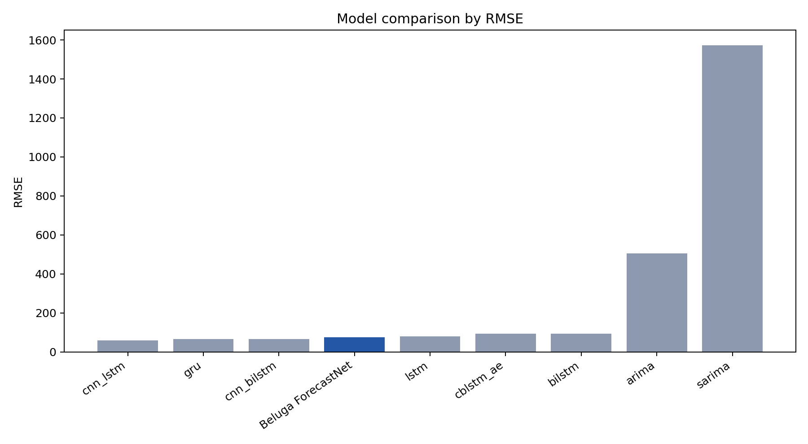
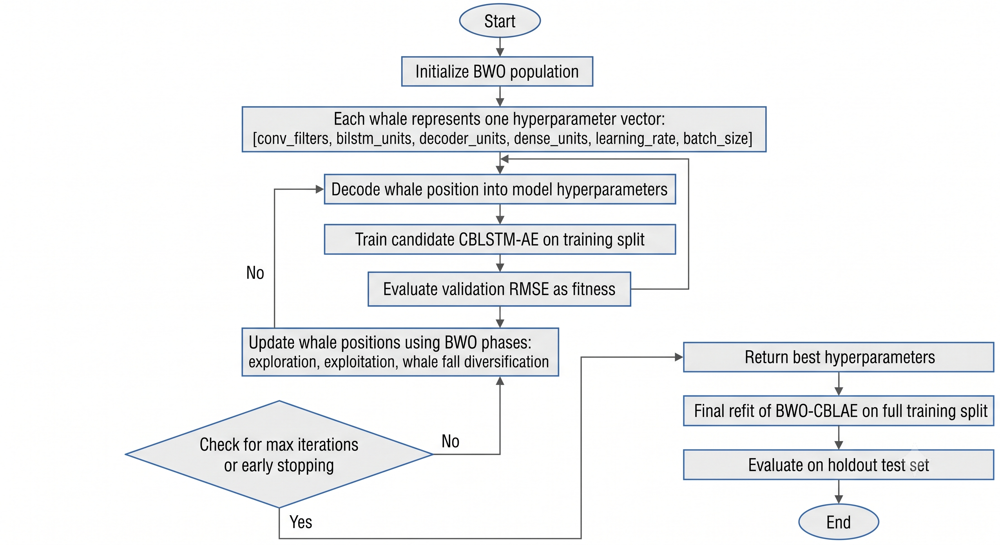
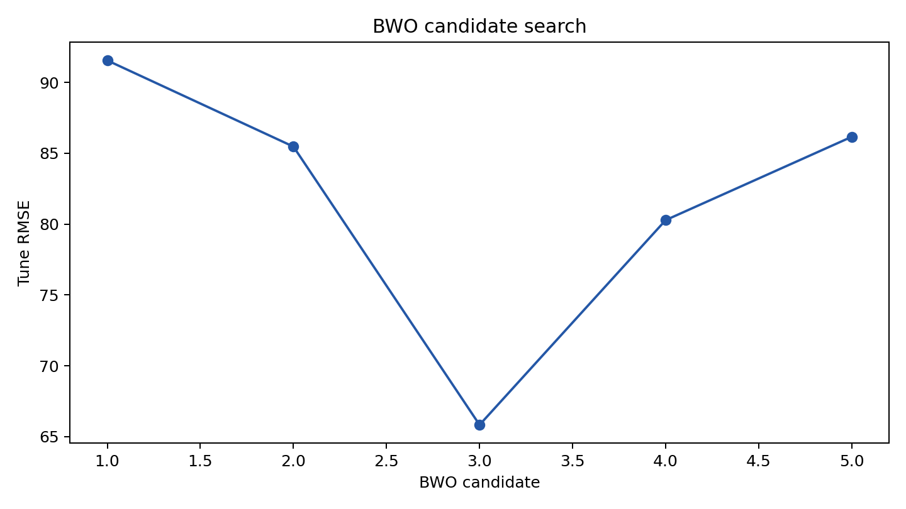
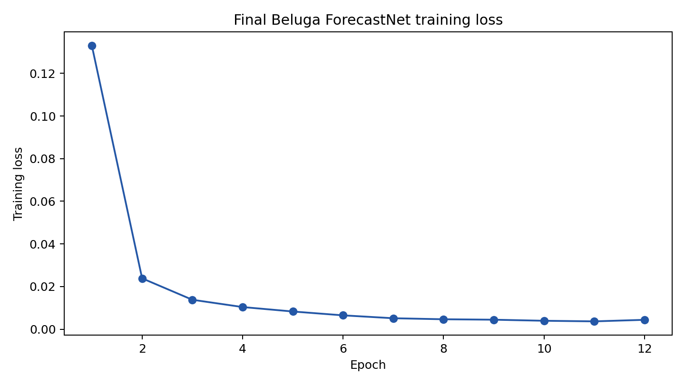
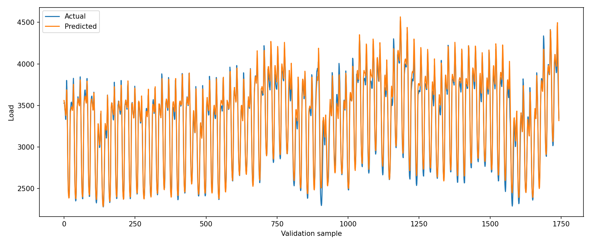

# Beluga ForecastNet: Short-Term Load Forecasting Using Beluga Whale Optimized Convolutional BiLSTM Autoencoder

**Beluga ForecastNet** is a short-term load forecasting model built from a paper-faithful **CBLSTM-AE** architecture tuned by **Beluga Whale Optimization (BWO)** on the GEFCom2014 electricity load dataset.

Full name:

```text
Beluga ForecastNet: Beluga Whale Optimized Convolutional BiLSTM Autoencoder
```

The implemented pipeline follows:

```text
GEFCom2014 hourly load + temperature
-> non-leaky feature engineering
-> train-only z-score scaling
-> rolling forecast windows
-> Beluga ForecastNet CBLSTM-AE
-> BWO hyperparameter search
-> final model refit
-> holdout evaluation and baseline comparison
```

## Current Result

The checked-in artifacts use the compact MacBook-friendly GEFCom setup:

- Dataset: `GEFCom2014-E.xlsx`
- Slice: `2014-01-01 00:00` to `2014-12-31 23:00`
- Raw time series: `load` target and `temperature` exogenous input
- Engineered features: `61`
- Forecast horizon: next hour
- Window size: `48` hours
- Seed: `42`

| Rank | Model | RMSE | MAE | MAPE |
|---:|---|---:|---:|---:|
| 1 | CNN-LSTM | 59.95 | 44.17 | 1.34% |
| 2 | GRU | 64.65 | 48.69 | 1.44% |
| 3 | CNN-BiLSTM | 65.85 | 47.98 | 1.46% |
| 4 | Beluga ForecastNet | 75.40 | 55.49 | 1.69% |
| 5 | LSTM | 79.35 | 55.97 | 1.72% |
| 6 | CBLSTM-AE | 92.27 | 66.55 | 2.01% |
| 7 | BiLSTM | 92.44 | 65.32 | 2.01% |
| 8 | ARIMA | 505.47 | 417.90 | 13.66% |
| 9 | SARIMA | 1571.88 | 1390.88 | 42.94% |

Beluga ForecastNet beats the plain CBLSTM-AE by about **18.3% RMSE** and beats 5 of 8 baselines. On this compact run, CNN-LSTM is the strongest baseline, so the current honest claim is **competitive performance with a clear improvement over the paper architecture before BWO tuning**, not overall dominance.




## Beluga ForecastNet Model

Beluga ForecastNet keeps the CBLSTM-AE architecture paper-faithful and uses BWO only for hyperparameter selection.

### Architecture


The model architecture is:

```text
Conv1D
-> Conv1D
-> MaxPooling1D
-> Bidirectional LSTM encoder
-> Flatten
-> RepeatVector
-> LSTM decoder
-> TimeDistributed Dense
-> TimeDistributed Dense(1)
```

BWO tunes:

- convolution filters
- BiLSTM encoder units
- decoder LSTM units
- TimeDistributed dense units
- learning rate
- batch size

### BWO Optimization Flow



Best checked-in BWO result:

```text
conv_filters: 96
bilstm_units: 128
decoder_units: 64
dense_units: 16
learning_rate: 0.001
batch_size: 32
```







## Repository Structure

```text
.
├── comparison_models/        # ARIMA/SARIMA and neural baselines
├── dataset/                   # GEFCom2014 electricity workbook
├── docs/
│   ├── figures/               # README-ready plots
│   └── results/               # compact result tables
├── scripts/
│   ├── generate_results_report.py
│   ├── run_beluga_forecastnet.py
│   └── run_optuna_baselines.py
├── src/lfs_hdlbwo/            # Beluga ForecastNet model, BWO, metrics, dataset adapter
├── tests/                     # smoke tests
├── workflow.md
├── pyproject.toml
└── requirements.txt
```

## Setup

```bash
python3 -m venv .venv
source .venv/bin/activate
pip install -r requirements.txt
```

The workbook is parsed with the standard library, so `openpyxl` is not required.

## Run Beluga ForecastNet

Fast smoke test:

```bash
python3 scripts/run_beluga_forecastnet.py --smoke --no-save-model --log-level INFO
```

MacBook-friendly run:

```bash
python3 scripts/run_beluga_forecastnet.py \
  --bwo-population-size 3 \
  --bwo-max-iter 2 \
  --candidate-epochs 10 \
  --early-stopping-patience 3 \
  --window-size 48 \
  --epoch-log-interval 1 \
  --log-level INFO
```

Artifacts are written to:

```text
artifacts/beluga_forecastnet/
```

## Run Baseline Comparison

```bash
python3 scripts/run_optuna_baselines.py \
  --window-size 48 \
  --n-trials 5 \
  --statistical-trials 4 \
  --max-epochs 15 \
  --patience 3 \
  --log-level INFO
```

Artifacts are written to:

```text
artifacts/optuna_baseline_comparisons/
```

Baselines:

- ARIMA
- SARIMA
- LSTM
- GRU
- BiLSTM
- CNN-LSTM
- CNN-BiLSTM
- CBLSTM-AE

## Regenerate README Figures

After rerunning proposed or baseline experiments:

```bash
python3 scripts/generate_results_report.py
```

This updates:

```text
docs/results/model_comparison.csv
docs/results/experiment_summary.json
docs/figures/*.png
```

## Robustness Protocol

The current checked-in GEFCom result is a **single-seed run**. Do not claim five-seed robustness unless the following multi-seed runs have been executed and summarized.

Proposed model over five seeds:

```bash
for seed in 11 22 33 44 55; do
  python3 scripts/run_beluga_forecastnet.py \
    --seed "$seed" \
    --output-dir "artifacts/beluga_forecastnet_seed_${seed}" \
    --bwo-population-size 3 \
    --bwo-max-iter 2 \
    --candidate-epochs 10 \
    --early-stopping-patience 3 \
    --window-size 48 \
    --log-level INFO
done
```

Baseline robustness should use the same seeds, window, dataset slice, and holdout split. Once those artifacts exist, report mean and standard deviation for RMSE, MAE, and MAPE.

## Dataset

Use the GEFCom2014 electricity load track:

```text
dataset/GEFCom2014 Data/GEFCom2014-E_V2/GEFCom2014-E.xlsx
```

The adapter drops the known missing target period and uses the latest known year by default. The active compact setup uses 8,760 hourly rows from 2014.

Citation:

Tao Hong, Pierre Pinson, Shu Fan, Hamidreza Zareipour, Alberto Troccoli, and Rob J. Hyndman, "Probabilistic energy forecasting: Global Energy Forecasting Competition 2014 and beyond", International Journal of Forecasting, 2016.

## Verification

```bash
python3 -m compileall -q src comparison_models scripts tests
python3 -m unittest tests.smoke_test
```

## License and Citation

Code is released under the MIT License. See `LICENSE`.

Citation metadata is provided in `CITATION.cff`; it also includes the GEFCom2014 dataset paper reference.
